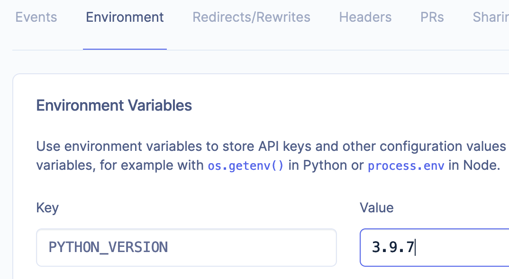

# Hosting

`coltrane` can be used on hosting sites just like any other static site generator.

## render.com

- Set the `PYTHON_VERSION` environment variable to the desired Python version (must be at least 3.8)

- Go to `settings` and use `pip install poetry && poetry install && poetry run coltrane build` for the `Build Command`

